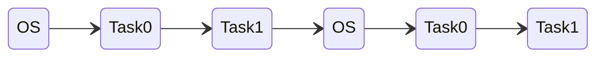

# MultiTasking


In the previous episode [ContextSwitch](https://archfx.github.io/posts/2023/08/tinyos2/) of **TinyOS**🐞, we introduced the context switching mechanism under the RISC-V architecture. In this episode we will be looking at Multitasking in our DIY operating system.

## Cooperative multitasking

Modern operating systems have a "Preemptive" function that forcibly terminates the process through timed interruption, so that when a certain process occupies the CPU for too long, it is forcibly interrupted and switched to another process for execution.

However, in a system without a time interruption mechanism, the operating system cannot interrupt the current execution process, so it must rely on each process to actively return control to the operating system in order to allow all processes to have a chance to execute.

This notion of multi-tasking system that relies on an automatic return mechanism is called a **Coorperative Multitasking** system.

Windows 3.1 launched by Microsoft in 1991, as well as [HeliOS](https://github.com/MannyPeterson/HeliOS) on the single-board computer arduino, are all operating systems that employee "cooperative multitasking" mechanism.

In this chapter, we will design a "cooperative multitasking" job system on a RISC-V processor.

First let's execute the program. For this you can navigate to the [03-MultiTasking](https://github.com/Archfx/tinyos/tree/master/03-MultiTasking) from the docker image. If you missed the first article about setting up the environment, you can check it from [here](https://archfx.github.io/posts/2023/08/tinyos0/).


First let's take a look at the system's performance.
```sh
cd tinyos/03-MultiTasking
make qemu
```
<code>
Press Ctrl-A and then X to exit QEMU<br>
qemu-system-riscv32 -nographic -smp 4 -machine virt -bios none -kernel os.elf<br>
OS start<br>
OS: Activate next task<br>
Task0: Created!<br>
Task0: Now, return to kernel mode<br>
OS: Back to OS<br>
&nbsp; <br>
OS: Activate next task<br>
Task1: Created!<br>
Task1: Now, return to kernel mode<br>
OS: Back to OS<br>
&nbsp; <br>
OS: Activate next task<br>
Task0: Running...<br>
OS: Back to OS<br>
&nbsp; <br>
OS: Activate next task<br>
Task1: Running...<br>
OS: Back to OS<br>
&nbsp; <br>
OS: Activate next task<br>
Task0: Running...<br>
OS: Back to OS<br>
&nbsp; <br>
OS: Activate next task<br>
Task1: Running...<br>
OS: Back to OS<br>
&nbsp; <br>
OS: Activate next task<br>
Task0: Running...<br>
OS: Back to OS<br>
&nbsp; <br>
OS: Activate next task<br>
Task1: Running...<br>
OS: Back to OS<br>
&nbsp; <br>
OS: Activate next task<br>
Task0: Running...<br>
QEMU: Terminated<br>
</code>

You can see that the system keeps switching between two tasks `Task0`, `Task1`, but the actual switching process is as follows:




## User Tasks

In [user.c](https://github.com/Archfx/tinyos/blob/master/03-MultiTasking/user.c), we define two tasks, `user_task0` and `user_task1`, and finally initialize these two tasks in the `user_init` function.


```c
// user.c
#include "os.h"

void user_task0(void)
{
	lib_puts("Task0: Created!\n");
	lib_puts("Task0: Now, return to kernel mode\n");
	os_kernel();
	while (1) {
		lib_puts("Task0: Running...\n");
		lib_delay(1000);
		os_kernel();
	}
}

void user_task1(void)
{
	lib_puts("Task1: Created!\n");
	lib_puts("Task1: Now, return to kernel mode\n");
	os_kernel();
	while (1) {
		lib_puts("Task1: Running...\n");
		lib_delay(1000);
		os_kernel();
	}
}

void user_init() {
	task_create(&user_task0);
	task_create(&user_task1);
}
```

## Main Program

Then, in the main program [os.c](https://github.com/Archfx/tinyos/blob/master/03-MultiTasking/os.c) of the operating system, we use the big cycle method to arrange each process to be executed sequentially.

```c
// os.c
#include "os.h"

void os_kernel() {
	task_os();
}

void os_start() {
	lib_puts("OS start\n");
	user_init();
}

int os_main(void)
{
	os_start();
	
	int current_task = 0;
	while (1) {
		lib_puts("OS: Activate next task\n");
		task_go(current_task);
		lib_puts("OS: Back to OS\n");
		current_task = (current_task + 1) % taskTop; // Round Robin Scheduling
		lib_puts("\n");
	}
	return 0;
}
```

The above scheduling method is in principle consistent with [Round Robin Scheduling](https://en.wikipedia.org/wiki/Round-robin_scheduling), but Round Robin Scheduling must be equipped with a timed interruption mechanism in principle, but the code in this episode has no timed interruptions, so it can only be said to be the Round Robin Scheduling of the collaborative multitasking version.

Cooperative multitasking must rely on each task to actively return control. For example, in `user_task0`, whenever the `os_kernel()` function is called, the context switching mechanism will be called to return control to the operating system.

```c
void user_task0(void)
{
	lib_puts("Task0: Created!\n");
	lib_puts("Task0: Now, return to kernel mode\n");
	os_kernel();
	while (1) {
		lib_puts("Task0: Running...\n");
		lib_delay(1000);
		os_kernel();
	}
}
```

The `os_kernel()` function of [os.c](https://github.com/Archfx/tinyos/blob/master/03-MultiTasking/os.c) will call the `task_os()` of [task.c](https://github.com/Archfx/tinyos/blob/master/03-MultiTasking/task.c)

```c
void os_kernel() {
	task_os();
}
```

And `task_os()` will call sys_switch in assembly language [sys.s](https://github.com/Archfx/tinyos/blob/master/03-MultiTasking/sys.s) to switch back to the operating system.

```c
// switch back to os
void task_os() {
	struct context *ctx = ctx_now;
	ctx_now = &ctx_os;
	sys_switch(ctx, &ctx_os);
}
```

So the whole system is executed in turn letting the other process to execute under the cooperation of `os_main()`, `user_task0()`, `user_task1()`.

`os_main()` function in [os.c](https://github.com/Archfx/tinyos/blob/master/03-MultiTasking/os.c) looks like this.

```cpp
int os_main(void)
{
	os_start();
	
	int current_task = 0;
	while (1) {
		lib_puts("OS: Activate next task\n");
		task_go(current_task);
		lib_puts("OS: Back to OS\n");
		current_task = (current_task + 1) % taskTop; // Round Robin Scheduling
		lib_puts("\n");
	}
	return 0;
}
```

`user_task0()` and `user_task1()` functions in [user.c](https://github.com/Archfx/tinyos/blob/master/03-MultiTasking/user.c) looks like this.

```cpp
void user_task0(void)
{
	lib_puts("Task0: Created!\n");
	lib_puts("Task0: Now, return to kernel mode\n");
	os_kernel();
	while (1) {
		lib_puts("Task0: Running...\n");
		lib_delay(1000);
		os_kernel();
	}
}

void user_task1(void)
{
	lib_puts("Task1: Created!\n");
	lib_puts("Task1: Now, return to kernel mode\n");
	os_kernel();
	while (1) {
		lib_puts("Task1: Running...\n");
		lib_delay(1000);
		os_kernel();
	}
}
```

The above is an example of a specific and micro cooperative multitasking system on the RISC-V processor. In the next episode of TinyOS🐞, let's look at implementation of TimerIntterupts.
